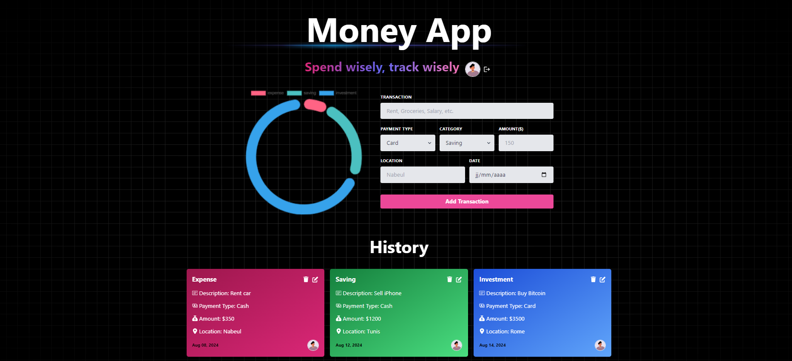

<h1 align="center" id="title">Money App</h1>


<p id="description">This project is designed to help you manage your expenses efficiently using a modern MERN stack and GraphQL.</p>

<h2>🚀 Demo</h2>

[https://money-map-brr9.onrender.com](https://money-map-brr9.onrender.com)

<h2>Project Screenshots:</h2>



  
  
<h2>🧐 Features</h2>

Here're some of the project's best features:

*   🌟 Tech stack: MERN (MongoDB Express.js React.js Node.js) + Apollo GraphQL
*   📝 Learn type definitions and resolvers for defining GraphQL schema and data fetching logic
*   🔄 Mutations for modifying data in the GraphQL API and establishing graph relations
*   🎃 Authentication with Passport.js and MongoDB session store
*   🚀 Global state management with Apollo Client
*   ⭐ Deployment made easy with a platform called Render

<h2>🛠️ Installation Steps:</h2>

<p>1. Clone Project</p>

```
git clone https://github.com/akrem-hchaichi/money-map.git
```

<p>2. Setup .env file</p>

```
MONGO_URI=...  SESSION_SECRET=...
```

<p>3. Build the app</p>

```
npm run build
```

<p>4. Start the app</p>

```
 npm run start
```

  
  
<h2>💻 Built with</h2>

Technologies used in the project:

*   React.js
*   Node.js
*   Express.js
*   MongoDB
*   GraphQL